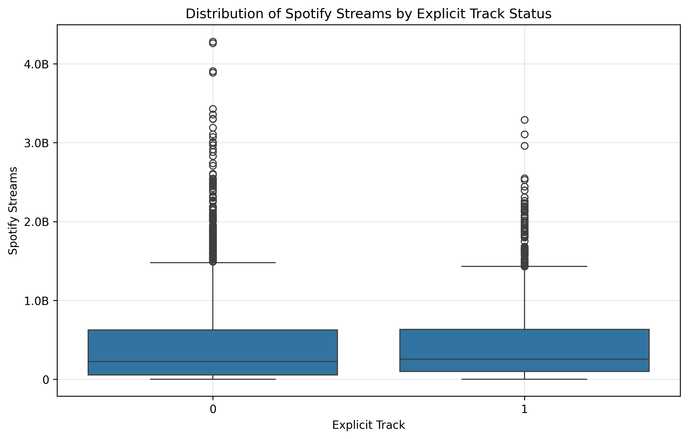
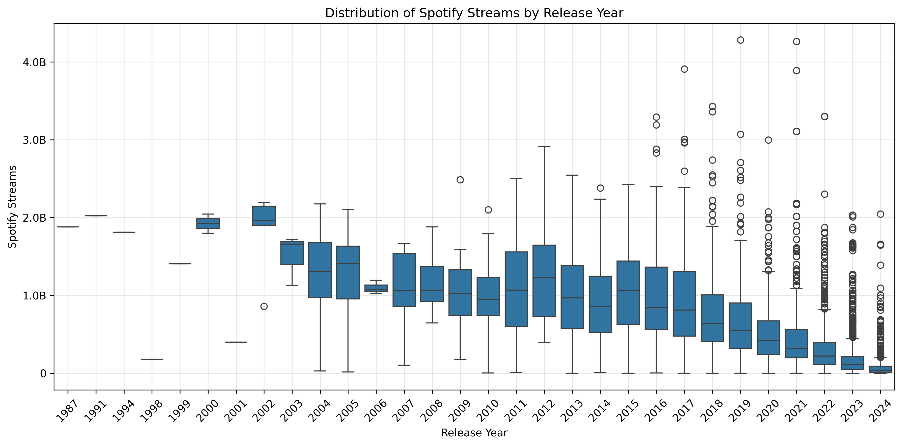

# Spotify Songs Data Analysis – 2024
 
This analysis explores several key questions related to the popularity of songs across platforms such as Spotify, YouTube, and TikTok. The dataset includes streaming statistics, release dates, and metadata like explicit content labeling.

**1. Is There a Relationship Between Spotify Streams and YouTube Views?**

I examined the relationship using a scatter plot and a linear regression line.

**Figure 1: A scatter plot showing a moderate positive correlation (Pearson = 0.47) between Spotify streams and YouTube views. Most songs cluster in the lower ranges, while a few outliers indicate platform-specific success.**

Pearson Correlation Coefficient: 0.47

Interpretation: A moderate positive correlation exists between the two variables. Songs that perform well on Spotify tend to also perform well on YouTube, but the relationship isn't strong enough to make precise predictions.

Observations:
Several outliers indicate songs that are disproportionately successful on one platform.
Most data points are clustered in the low-to-medium range, indicating moderate popularity for the majority of songs.

Possible Explanation:
Differences in platform dynamics (e.g., playlists vs. visual content, algorithm reach, user base demographics) may account for variations in performance.

**2. Do TikTok Posts Impact Spotify Streams?**

I analyzed the impact using a scatter plot and correlation analysis.

**Figure 2: This scatter plot demonstrates an extremely weak linear relationship (Pearson = 0.03) between TikTok posts and Spotify streams. The flat regression line and random spread indicate little to no impact from TikTok activity on stream counts.**

Pearson Correlation Coefficient: 0.03

Interpretation:
No strong linear relationship exists between the number of TikTok posts using a song and its Spotify stream count.

Observations:
Points are scattered randomly, with no visible trend.
The regression line is nearly flat, further supporting the lack of correlation.

Conclusion:
TikTok and Spotify may promote music based on different mechanisms. A song can trend on TikTok without significant Spotify traction and vice versa. Viral success may depend on content type, audience behavior, and platform-specific algorithms.

**3. Are Explicit Songs More or Less Popular?**

I compared Spotify stream counts between explicit and non-explicit tracks using boxplots and group statistics.

**Figure 3: A boxplot comparing Spotify stream counts for explicit and clean songs. Clean songs show a slightly higher overall distribution and more extreme outliers, possibly due to broader accessibility on public platforms.**

Distribution:
Clean songs: 64.11%
Explicit songs: 35.89%

Average Streams:
Clean songs: 448.6 million
Explicit songs: 445.3 million

Findings:
Stream counts are very similar on average.
Clean songs exhibit more extreme outliers, suggesting a few exceptionally popular clean tracks.

Interpretation:
Clean songs may enjoy broader distribution on platforms like radio or public playlists, contributing to occasional viral success.

**4. Are Newer Songs More Successful?**

I examined streaming performance across different release date periods.

 
**Figure 4: Boxplot showing the evolution of song performance over time. The 2000–2017 period shows a stable golden age of streaming, while recent years (2018–2024) exhibit increased variance and extreme outliers, reflecting market saturation and viral success patterns.**

Key Trends:
1957–1999: Limited representation, generally low stream counts.

2000–2017 (Golden Era):
Highest average streams.
Relatively stable distribution.
Moderate outliers in the 2–3 billion range.

2018–2024 (Modern Era):
More frequent extreme values (up to 4+ billion).
Higher variability and wider interquartile ranges.
Lower median stream count compared to earlier periods.

Observations:
Recent years show greater disparity between hits and average songs.
Increased volume of releases, especially post-2019, introduces more competition and volatility.
Earlier eras had fewer but more stable performers.

Conclusion:
While the volume of music has increased, average success has declined slightly in recent years, though top-performing hits are more extreme. This may reflect the fragmented nature of modern music consumption.

